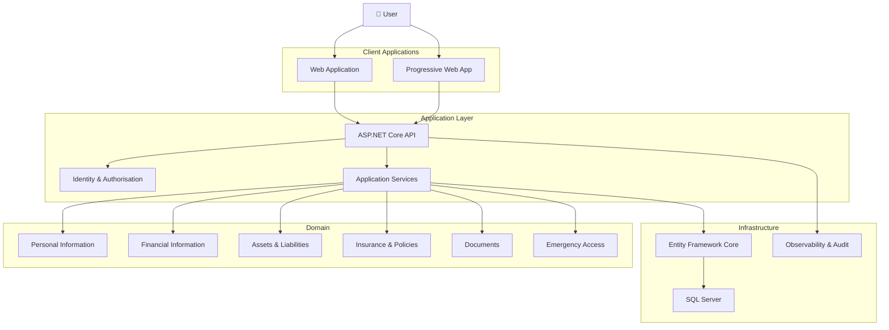

<p align="center">
  
</p>

  <p align="center">
    <strong></strong>
  </p>
<h3 align="center">Software Architect · Senior .NET Engineer · Financial Technology</h3>


[](https://github.com/kkurapaty)
[](https://www.linkedin.com/in/kkurapaty/)
[](https://dotnet.microsoft.com/)
[](https://learn.microsoft.com/dotnet/csharp/)

---

## 👋 About Me

I am a software engineer and architect focused on building **high-performance,
secure and resilient enterprise applications**. 25+ years building systems for 
**banking** and **commodities trading**, with deep expertise in .NET, Angular, WPF, 
and enterprise architecture patterns. I’ve worked extensively in **investment banking**, 
focusing on **commodities trading**, **settlement systems** and **front-office development**.

My engineering interests span from low-level performance and concurrency
through to distributed systems, application architecture and cloud platforms.

I particularly enjoy taking complex technical problems and turning them into
**simple, observable and maintainable systems**.

```text
Architecture       →  Design systems that survive change
Performance        →  Measure first, optimise with evidence
Engineering        →  Prefer simplicity over accidental complexity
Security           →  Treat security as an architectural concern
Reliability        →  Design for failure, recovery and observability
Quality            →  Build software that remains understandable
```

---

## ⚡ Engineering Focus

<table>
<tr>
<td width="33%" valign="top">

### 🏛 Architecture

* Enterprise architecture
* Distributed systems
* Domain-driven design
* Clean architecture
* Event-driven systems
* API architecture
* Multi-tenancy
* Integration patterns

</td>
<td width="33%" valign="top">

### 🚀 Performance

* Low-latency applications
* Concurrency
* Async programming
* Memory optimisation
* GC analysis
* Database performance
* WPF rendering
* Profiling & diagnostics

</td>
<td width="33%" valign="top">

### 🔐 Enterprise

* Identity & authentication
* Authorisation
* Secure APIs
* Resilience
* Observability
* Audit & compliance
* Data protection
* Operational tooling

</td>
</tr>
</table>

---

# 🧰 Technology

### Microsoft / .NET


### Data & Infrastructure


### Engineering


## 🚀 Tech Stack & Frameworks
             

## ☁️ Cloud & Infrastructure
       

## 🗄️ Data & Search
        

### 🛠️ Tools & DevOps
         

### ✅ Testing & Quality
     

### 🎨 Design
 

---

# ⭐ Featured Projects

## 🏠 PIMS — Personal Information Management System

> A secure, family-oriented information management platform designed to
> consolidate personal, financial, asset, insurance, document and emergency
> information into a single system.

### Architecture



### Technology

`C#` `ASP.NET Core` `Blazor` `SQL Server` `EF Core` `OData`

### Engineering Highlights

* Multi-tenant architecture
* Identity-based authentication
* Role and policy-based authorisation
* Emergency access workflows
* Structured audit and system logging
* Financial and asset management
* Insurance and renewal tracking
* Document metadata management
* Health and operational monitoring
* Resilient database connectivity
* API and OData integration
* Responsive PWA architecture

**→ [Explore PIMS](https://github.com/kkurapaty/PIMS)**

---

# 🖥 WPF Engineering

A major area of interest is **high-performance WPF desktop engineering**,
particularly where responsiveness, concurrency and deterministic behaviour
matter.

```text
                    ┌────────────────────────┐
                    │       Presentation     │
                    │          WPF           │
                    └────────────┬───────────┘
                                 │
                    ┌────────────▼───────────┐
                    │      View Models       │
                    │   Commands / State     │
                    └────────────┬───────────┘
                                 │
                    ┌────────────▼───────────┐
                    │    Application Layer   │
                    │   Services / Policies  │
                    └────────────┬───────────┘
                                 │
              ┌──────────────────┼──────────────────┐
              │                  │                  │
       ┌──────▼──────┐    ┌──────▼──────┐    ┌──────▼──────┐
       │ Market Data │    │   Trading   │    │   Risk      │
       │   Feeds     │    │   Engine    │    │   Services  │
       └─────────────┘    └─────────────┘    └─────────────┘
```
**→ [Explore Rates Blotter](https://github.com/kkurapaty/BlotterDemo)**

### Areas of interest

* UI thread responsiveness
* Dispatcher behaviour
* Async/await
* Data binding performance
* Virtualisation
* Rendering performance
* Memory allocation
* GC pressure
* Lock contention
* Concurrent collections
* High-frequency updates
* MVVM architecture
* Real-time data visualisation

---

# 📐 Architecture Principles

I tend to approach architecture around a few fundamental principles:

### 01 — Make boundaries explicit

Separate responsibilities so that the system remains understandable as it
grows.

### 02 — Optimise with evidence

Performance work should begin with profiling, measurement and reproducible
benchmarks — not assumptions.

### 03 — Design for failure

Network failures, database failures, timeouts, dependency failures and partial
system failures should be expected rather than treated as exceptional surprises.

### 04 — Security belongs in architecture

Authentication, authorisation, tenancy isolation, data protection and auditing
should be designed into the system rather than added afterwards.

### 05 — Prefer boring infrastructure

The best architecture is often the simplest architecture that satisfies the
business and operational requirements.

### 06 — Observability is part of the product

Logs, metrics, health checks, correlation IDs and diagnostics should make the
system explainable when something goes wrong.

---

# 🧠 Engineering Topics

```text
.NET
 ├── C#
 ├── ASP.NET Core
 ├── Blazor
 ├── WPF
 ├── Entity Framework Core
 └── Dependency Injection

Architecture
 ├── Clean Architecture
 ├── Domain-Driven Design
 ├── SOLID
 ├── CQRS
 ├── Event-Driven Architecture
 └── Distributed Systems

Performance
 ├── Concurrency
 ├── Async/Await
 ├── Memory Management
 ├── GC / Allocations
 ├── Database Optimisation
 └── Low-Latency Design

Enterprise
 ├── Identity
 ├── Authorisation
 ├── Multi-Tenancy
 ├── Auditing
 ├── Observability
 └── Resilience

Data
 ├── SQL Server
 ├── EF Core
 ├── Stored Procedures
 ├── Query Optimisation
 └── Data Modelling
```

---

# 📊 GitHub

<p align="center">


</p>

<p align="center">


</p>

---

# 🧪 What I Like Building

```text
High-performance desktop applications
              ↓
Real-time enterprise systems
              ↓
Financial technology platforms
              ↓
Secure APIs and distributed services
              ↓
Data-intensive applications
              ↓
Developer tooling and infrastructure
              ↓
Systems that are easier to operate than they are to build
```

---

# 📚 Engineering Notes

I use GitHub not only for code, but also to document engineering thinking.

Topics include:

* Architecture decision records
* Performance investigations
* WPF optimisation
* .NET internals
* Database optimisation
* API design
* Security patterns
* Distributed systems
* Production diagnostics
* Lessons learned from real systems

---
### 📊 GitHub Stats


<p align="center">
  
  
</p>
 
# 🏆 Engineering Philosophy

> **Good software is not merely software that works.
> Good software is software that can continue to work when everything around
> it changes.**

I value:

**Clarity · Simplicity · Performance · Security · Resilience · Observability**

---

# 🤝 Let's Connect

I'm always interested in conversations around:

**.NET · C# · WPF · Software Architecture · FinTech · Low Latency ·
Distributed Systems · Performance Engineering**

<p align="center">

<a href="https://github.com/kkurapaty">

</a>

<a href="https://www.linkedin.com/in/kkurapaty/">

</a>

</p>

---

<p align="center">

### Building software that is fast, secure, resilient and understandable.

<sub>© Kiran Kurapaty</sub>

</p>
